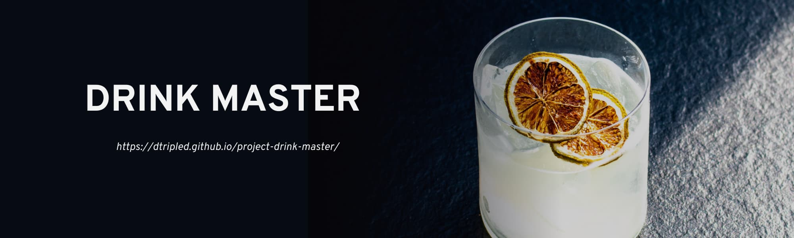

<h1 align="center">Drink Master</h1>
<h2 align="center">

This project was created with the help of 
[Vite + React](https://github.com/vitejs/vite).
To familiarize yourself with and configure additional features [refer to documentation.](https://vitejs.dev/guide/)

## About this project

Drink Master is a SPA for those who wants to mix some cocktails. The site allows:
* user registration and authorization
* sharing your recipes
* searching recipes by categories, ingredients or querry
* adding recipes to the list of favorites
* subscribing to the newsletters
* changing the color theme (light / dark)

The aplication has an adaptive design and can be used on desktops, tablets and mobile devices.

### Backend

The project interacts with **Drink Master API**, the documentation for which can be accessed [via this link](https://drink-master-backend.onrender.com/api-docs/)

## Installing and launching the app

1. Make sure you have the LTS version of Node.js installed on your computer.
   [Download and install here](https://nodejs.org/en/) if necessary.
2. Install the basic dependencies of the project with the `npm install` command.
3. Start development mode by executing `npm run dev` command.
4. Go to the browser at [http://localhost:5173/project-drink-master/](http://localhost:5173/project-drink-master/).
   This page will automatically reload after saving changes to project files.

## Deploy

The production version of the project will automatically be linted, compiled and deployed to GitHub Pages, in the `gh-pages` branch, whenever the `main` branch is updated. For example, after a direct push or an accepted pull request.

### Live page

Live page can be accessed via [https://dtripled.github.io/project-drink-master/](https://dtripled.github.io/project-drink-master/)

## Team

This project was created by:

* [DTripleD](https://github.com/DTripleD) - team lead
* [MargaritaSukhova](https://github.com/MargaritaSukhova) - developer, scram master
* [moskalenko-mm](https://github.com/moskalenko-mm) - developer
* [IskraI](https://github.com/IskraI) - developer
* [gulen13](https://github.com/gulen13) - developer
* [LidiiaChyrnyshuk](https://github.com/LidiiaChyrnyshuk) - developer
* [jane05070](https://github.com/jane05070) - developer
* [Alexon7](https://github.com/Alexon7) - developer
* [andreas7500](https://github.com/andreas7500) - developer
* [vladvl1](https://github.com/vladvl1) - developer

